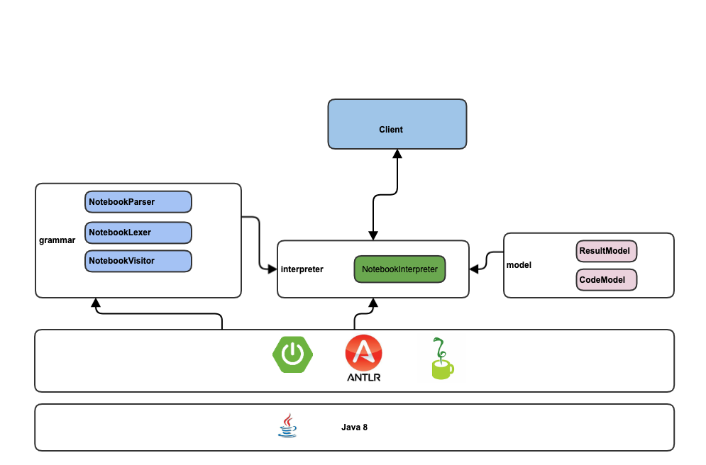

# Notebook
A Spring boot notebook for python 

## Architecture of the application
Here below a succint representation of the application architecture :

It comprised three (3) main packages :

*  **com.oracle.notebook.model** : it contents the models representing the input code and the result of the execution;
* **com.oracle.notebook.grammar** : it contents the classes for python language parsing ;
* **com.oracle.notebook.interpreter** : it contains the solely class *NotebookInterpreter* considered as the core of the application. It take the input , parse it and give the result of the interpretation.
The application is a Spring Boot based application with additional librairies such as *jython*(used as an embedded python interpreter for java),  *ANTLR* (used for generating the recognizer of python language and many others)


##  Install and use it 

1. Clone the project 
2. Unzip and go the root of project 
3. Ignite the command (example for linux niche): 
```shell 
./mvnw 
```
or execute in your favorite editor through the project execution shortcut.
4. Submit a JSON object with a such a structure 
```json
{"code":"%python pythoncode"}
```
where *pythoncode* is a python snippet, to the endpoint  **/execute** like this : 
```shell
curl -X POST  http://localhost:8080/execute  -d '{"code": "%python a=23 "}'
```
You can also test with API test environment such as Postman.


## Author
Constantin DRABO (drconstantin@hotmail.com)


